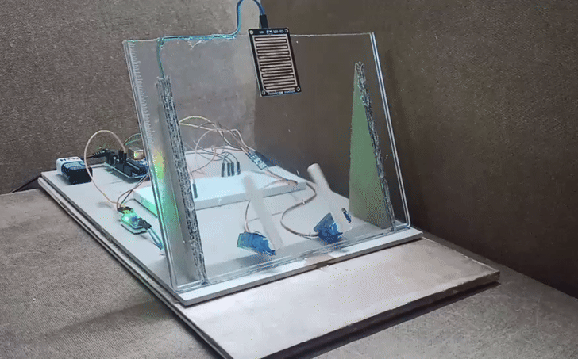
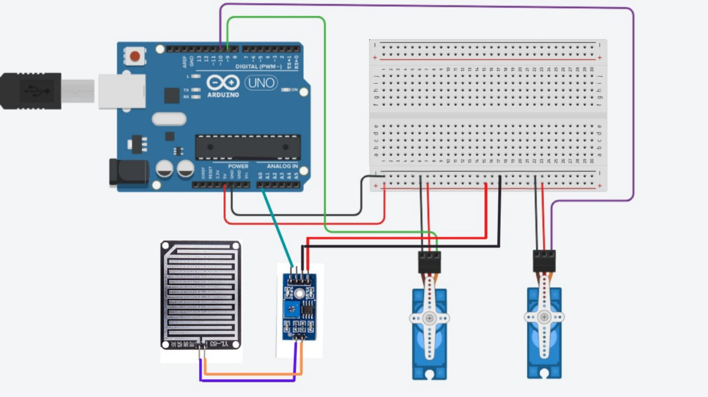
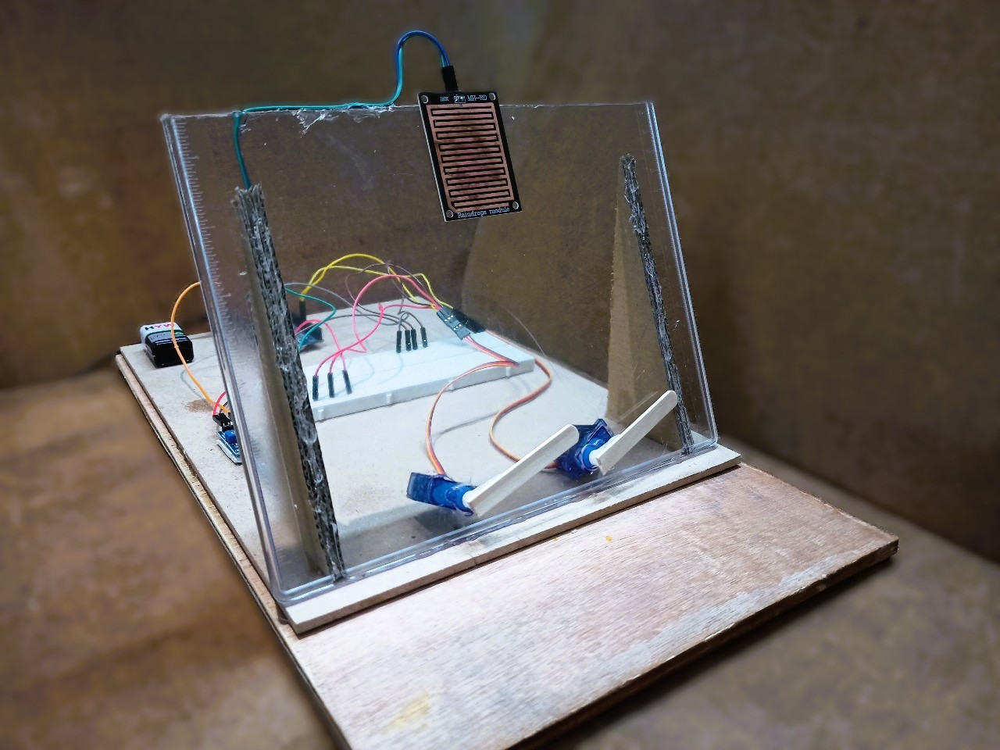

# 🚗💧Automatic Rain Sensing Car Wipers

This project automatically detects rainfall using a rain sensor and activates car wipers using servo motors.  
It adjusts wiper speed based on rain intensity using Arduino.

## How It Works:
- A **rain sensor** detects the presence of water (raindrops).
- When rain is detected, the **Arduino UNO** triggers a **servo motor**, simulating the wiper movement.
- Once the rain stops, the system turns off the wiper automatically.
- No manual action is required by the driver.

### Demo:

### 🔧Circuit Diagram:

### Components Used:
- Arduino UNO
- Rain Sensor
- Servo Motors
- Jumper Wires
- Breadboard
- Battery

### Code:
See `main_code.ino`

## 🎯Key Features
- Fully automatic wiper activation  
- Low cost and easy to build
- Improves safety by minimizing driver distraction

### 📸Real Setup

## 📚What I Learned
- Interfacing sensors and actuators with Arduino  
- Real-time automation using microcontrollers  
- Circuit design and prototyping on breadboard  
- Debugging and improving system reliability

## Acknowledgment🙏
Project idea based on various educational YouTube tutorials.This project was built for learning purposes as part of my diploma final year work.
